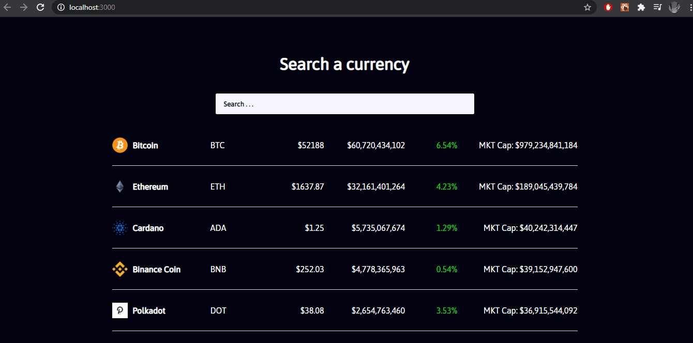

# Cryptocurrency Finance Price Tracker App
We use React Hook for this React JS Project. We mainly use useEffect and useState
You be able to search currencies and have it display on the browser. Also, the prices will update live whenever you refresh the page. We get all of the data from a public API.  

[The API Link](https://www.coingecko.com/en/api).

## Demo

